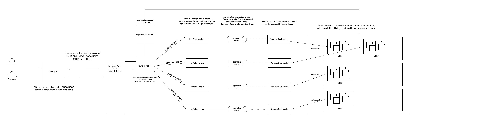

# Key-Value-Store-v2 (Version 2)

#### Crucial Notice: Version 2 of my Key-Value Store project, accessible at [this link](https://github.com/HRS05/Key-Value-Store), marks a significant evolution in functionality and efficiency, leveraging core Java principles.
#### In this latest iteration, I've concentrated on the following enhancements:

* Thread Optimization: Employed advanced thread optimization techniques, introducing the concept of virtual threads, alongside the utilization of Java version 21.

* Integration with Spring Boot: Seamlessly integrated the core project with Spring Boot, augmenting its scalability and ease of deployment.

* Client SDK Development: Crafted a robust Client SDK in Java utilizing GRPC, facilitating seamless communication with the Key-Value Store.

* REST API Support: Added comprehensive support for RESTful API calls, ensuring compatibility with diverse client applications.

* SAAS Level Application: Enthusiastically adhered to industry best practices and guidelines, striving to elevate the project to a Software as a Service (SAAS) level application.

* From Scratch Development: Emphasized a ground-up approach, eschewing reliance on external database or messaging queue support. Instead, leveraged core Java concepts to construct a robust and self-sufficient system.

These updates collectively aim to enhance the project's performance, scalability, and interoperability, ushering in a new era of efficiency and versatility.

## Architectural Views

